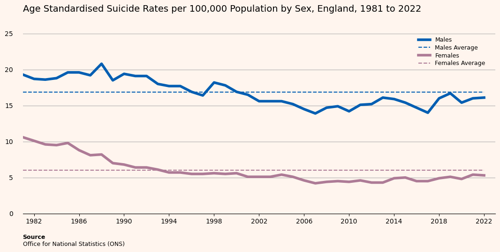
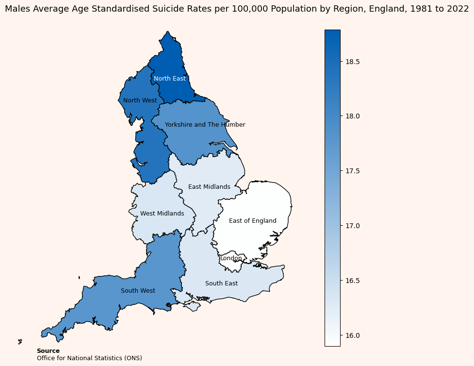

## Uncovering Suicide Patterns in England Using Data Visualisation

Created by [Junaid Din](https://github.com/junaid-din)

This project explores suicide patterns and trends across three distinct population groups in England: the general population, prison inmates, and higher education students. Leveraging datasets from the Office for National Statistics (ONS), the study uses data visualisation techniques to highlight demographic, temporal, and regional trends in suicide rates. The goal is to uncover insights that can inform more targeted and effective suicide prevention strategies. By combining multiple data sources and applying accessible, theory-backed visual design principles, the project reveals disparities and risk concentrations often hidden in raw statistics.

Tasks completed:

* Preprocessed and cleaned data
* Applied visualisation techniques, including: Line plots (for temporal suicide rate trends), Heatmaps (for age-specific rate patterns over time), Choropleth maps (to explore regional disparities in suicide rates), Bar charts (for comparisons across groups)
* Applied colour theory and accessibility design by using colourblind-safe palettes and gender-representative colours as well as high contrast and minimalistic design for clarity
* Integrated Gestalt theory and the principle of proportional ink to enhance visual intuitiveness

  
  

